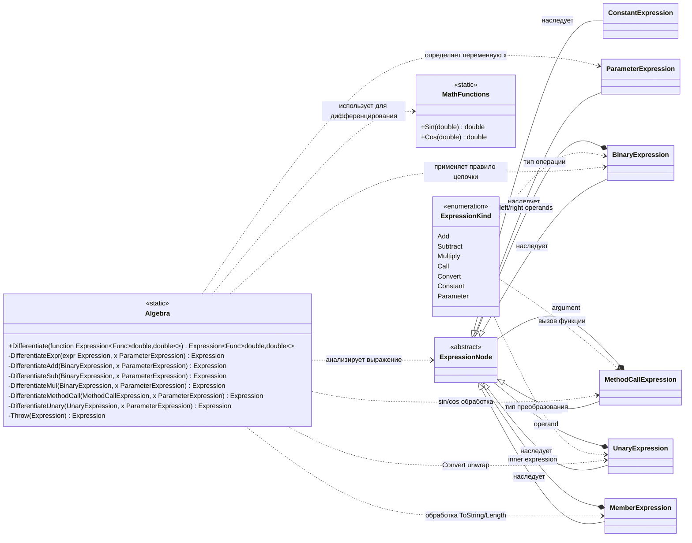

# Практика: Дифференцирование

## 1. Описание предметной области и сущностей
Algebra - основной класс дифференцирования выражений. Разбирает Expression Tree и строит производную с использованием правил сложения, умножения и цепного правила.

ExpressionNode - абстрактное выражение дерева, базовый элемент всех типов выражений.

ConstantExpression - числовая константа, производная равна 0.

ParameterExpression - переменная функции (x), производная равна 1.

BinaryExpression - бинарное выражение (сложение, вычитание, умножение).

UnaryExpression - унарное выражение (например Convert), используется для раскрытия вложенных конструкций.

MethodCallExpression - вызов математической функции (Sin, Cos и др.).

MemberExpression - доступ к членам выражения (например ToString, Length), приводит к ошибке.

MathFunctions - содержит поддерживаемые математические функции Sin и Cos.

ExpressionKind — перечисление типов операций выражения.
## 2. Диаграмма классов (Mermaid)

