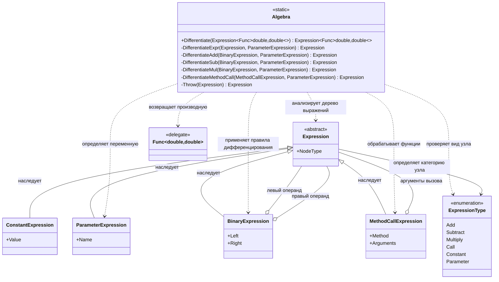

# Практика: Дифференцирование

## 1. Описание предметной области и сущностей
Algebra - основной класс символьного дифференцирования. Анализирует дерево выражений и строит производную по набору правил.

ExpressionElement - абстрактный элемент дерева выражений, общий предок всех узлов.

ConstantExpression - узел числовой константы, производная всегда равна 0.

ParameterExpression - узел переменной функции, производная по себе равна 1.

BinaryExpression - бинарная операция над двумя выражениями (сложение, вычитание, умножение).

MethodCallExpression - вызов математической функции, для которой применяется соответствующее правило дифференцирования.

DerivativeEngine - выполняет обработку узлов выражения и выбирает нужное правило вычисления производной.

IDerivativeRule - интерфейс правила дифференцирования отдельного типа выражений.

ConstantRule - правило для констант.

ParameterRule - правило для переменных.

BinaryRule - правило для бинарных операций.

TrigonometricRule - правило для тригонометрических функций Sin и Cos.

ExpressionCategory — перечисление категорий узлов дерева выражений.
## 2. Диаграмма классов (Mermaid)

