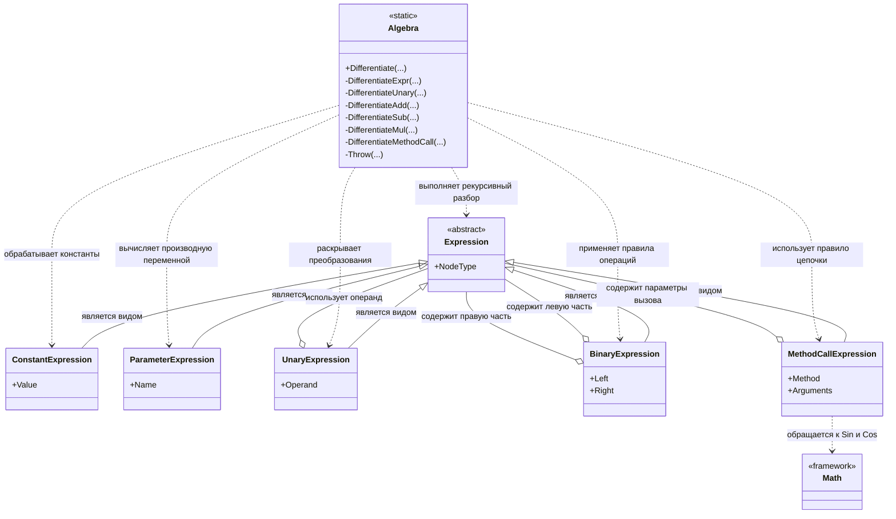

# Практика: Дифференцирование

## 1. Описание предметной области и сущностей
Algebra - основной класс символьного дифференцирования. Выполняет анализ дерева выражений и строит выражение производной по правилам математического дифференцирования.

Expression - абстрактный базовый класс для всех узлов дерева выражений.

ConstantExpression - узел числовой константы. При дифференцировании возвращает нулевое значение.

ParameterExpression - узел переменной функции. Производная переменной по самой себе равна единице.

UnaryExpression - узел унарной операции над выражением. Используется для обработки преобразований и отрицания.

BinaryExpression - узел бинарной операции над двумя выражениями. Представляет сложение, вычитание и умножение.

MethodCallExpression - узел вызова функции. Используется для обработки математических функций и применения правила цепочки.

Math - библиотечный класс математических функций. Используется для построения производных функций Sin и Cos.

ExpressionCategory - перечисление категорий узлов дерева выражений.
## 2. Диаграмма классов (Mermaid)

