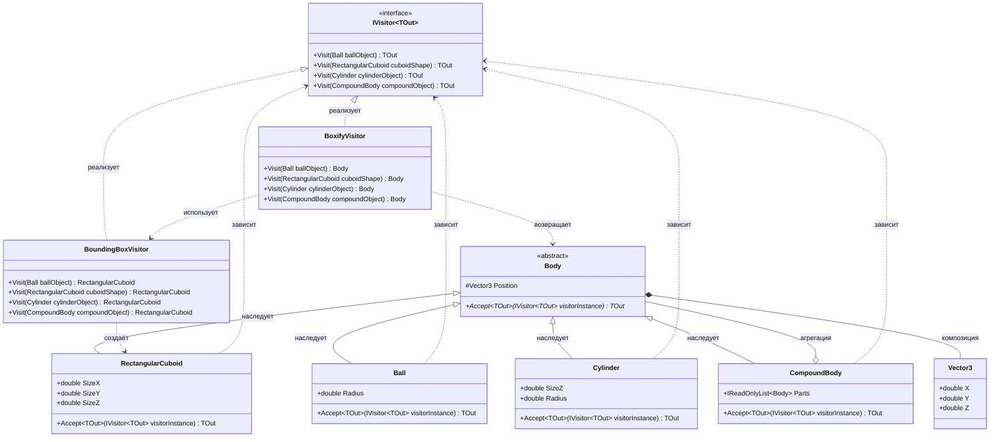

# Практика: Геомeтрия-2

## 1. Описание предметной области и сущностей

В системе представлены трёхмерные геометрические фигуры. Для выполнения операций над ними применяется паттерн Посетитель, что позволяет добавлять новые операции без изменения классов фигур.

IVisitor - обобщённый интерфейс. Определяет методы Visit для каждого типа фигуры. Возвращает результат типа TOut.

Body - абстрактный базовый класс. Хранит позицию фигуры. Содержит метод Accept для приёма посетителя.

Ball - шар. Наследник Body. Имеет радиус.

RectangularCuboid - параллелепипед. Наследник Body. Имеет размеры по трём осям.

Cylinder - цилиндр. Наследник Body. Имеет радиус и высоту.

CompoundBody - составное тело. Наследник Body. Содержит коллекцию вложенных тел.

Vector3 - структура координат. Хранит X, Y, Z.

BoundingBoxVisitor - посетитель. Вычисляет минимальный ограничивающий параллелепипед.
BoxifyVisitor - посетитель. Заменяет простые фигуры на параллелепипеды.

## 2. Диаграмма классов (Mermaid)

