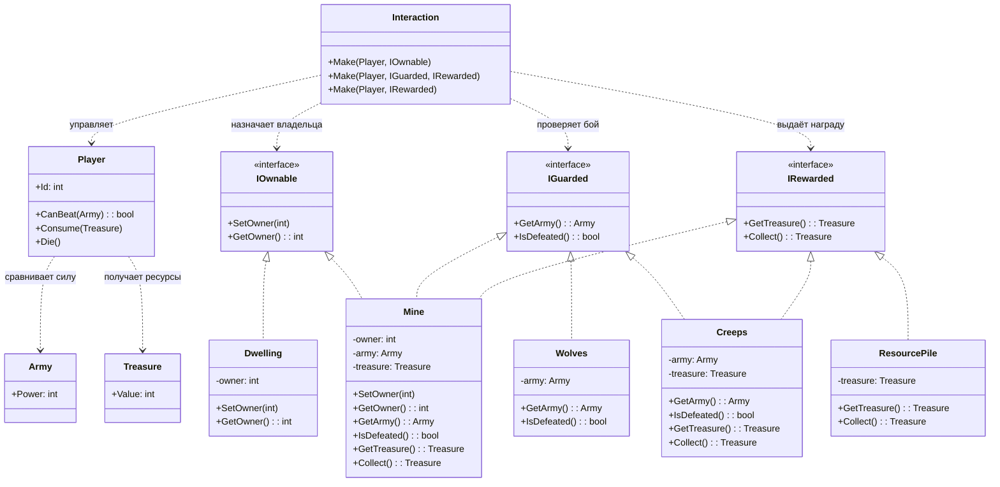

# Практика: HoMM

## 1. Описание предметной области и сущностей
В игре есть объекты карты и система взаимодействий, через которую игрок взаимодействует с ними. Объекты могут иметь владельца, быть защищены армией или содержать награду.

Player описывает игрока. У него есть Id, а также логика боя и взаимодействия: он может проверить, способен ли победить армию через CanBeat(Army), получать награду через Consume(Treasure) и погибать через Die(). Игрок также сравнивает силу с армией и получает сокровища.

Army задаёт боевую силу через поле Power, которое используется в проверке боя.
Treasure хранит количество ресурсов в поле Value, которое выдаётся игроку.

Interaction - система управления взаимодействиями. Метод Make(Player, object) связывает игрока с объектами карты и работает только через интерфейсы, не зная конкретного типа объекта.

IOwnable описывает объекты с владельцем (Owner). Его реализуют:

Dwelling - объект с владельцем
Mine - объект, который тоже может принадлежать игроку

IGuarded описывает объекты, которые защищены армией (Army). Его реализуют:

Wolves - враги с армией
Mine - объект, который нужно защищать в бою

IRewarded описывает объекты, которые дают награду (Treasure). Его реализуют:

ResourcePile - простой источник награды
Mine - содержит награду и выдаёт её
Creeps - дают награду после победы в бою

Связи взаимодействия:

Interaction работает с Player, назначает владельца через IOwnable, проверяет бой через IGuarded и выдаёт награду через IRewarded
Player взаимодействует с Army при бою и получает Treasure после победы
## 2. Диаграмма классов (Mermaid)

