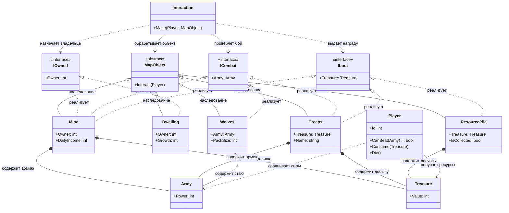

# Практика: HoMM

## 1. Описание предметной области и сущностей
В игре есть объекты карты и система взаимодействий, через которую игрок взаимодействует с ними. Объекты могут иметь владельца, участвовать в бою или содержать награду.

Player описывает игрока. У него есть Id, а также логика боя и взаимодействия: он может проверить, способен ли победить армию через CanBeat(Army), получать награду через Consume(Treasure) и погибать через Die(). Игрок сравнивает свою силу с армией и получает ресурсы из сокровищ.

Army задаёт боевую силу через поле Power, которое используется при сражениях. Treasure хранит количество ресурсов в поле Value, которое может получить игрок.

MapObject - абстрактный объект карты. От него наследуются все игровые объекты, с которыми может взаимодействовать игрок.

Interaction - система управления взаимодействиями. Метод Make(Player, MapObject) связывает игрока с объектами карты и работает через интерфейсы взаимодействия, не завися от конкретного типа объекта.

IOwned описывает объекты с владельцем (Owner). Его реализуют:

Dwelling - объект с владельцем и параметром роста (Growth)
Mine - объект с владельцем и ежедневным доходом (DailyIncome)

ICombat описывает объекты, связанные с боем и имеющие армию (Army). Его реализуют:

Wolves - противники со стаей (PackSize)
Creeps - нейтральные противники с именем (Name)
Mine - объект, который необходимо захватить через сражение

ILoot описывает объекты, содержащие награду (Treasure). Его реализуют:

ResourcePile - источник ресурсов, который можно собрать
Creeps - противники, выдающие награду после победы
Mine - объект, содержащий награду после захвата

Связи взаимодействия:

Interaction работает с объектами карты через MapObject, назначает владельца через IOwned, проверяет бой через ICombat и выдаёт награду через ILoot.
Player взаимодействует с Army при проверке боя и получает Treasure в качестве награды.

## 2. Диаграмма классов (Mermaid)

