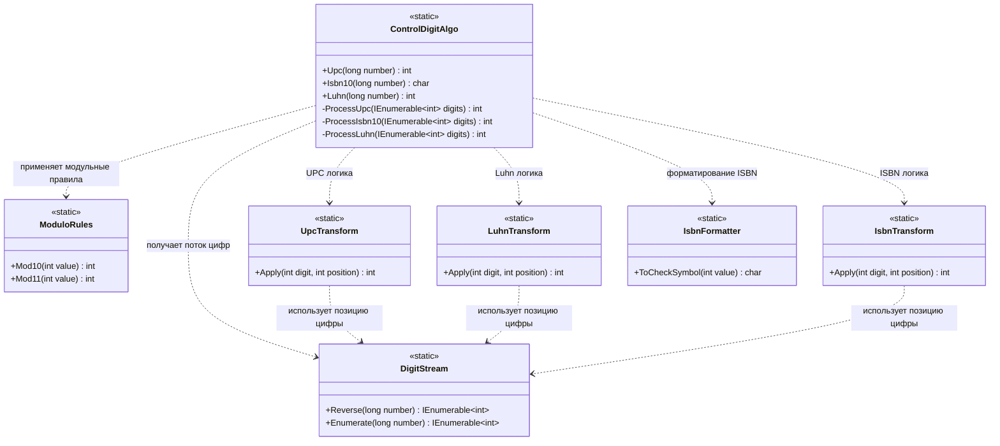

# Практика: Контрольный разряд

## 1. Описание предметной области и сущностей
ControlDigitAlgo - основной класс, который считает контрольные цифры (UPC, ISBN-10, Luhn) и объединяет логику алгоритмов.

Extensions - общие методы для работы с числами: получение цифр и вычисление по модулю.

DigitStream - превращает число в последовательность цифр.

ModuloRules - считает контрольную цифру по модулю 10 и 11.

UpcTransform - правила вычисления для UPC.

LuhnTransform - правила вычисления для Luhn.

IsbnTransform - правила вычисления для ISBN-10.

IsbnFormatter - преобразует результат ISBN-10 в символ (цифра или X).
## 2. Диаграмма классов (Mermaid)

