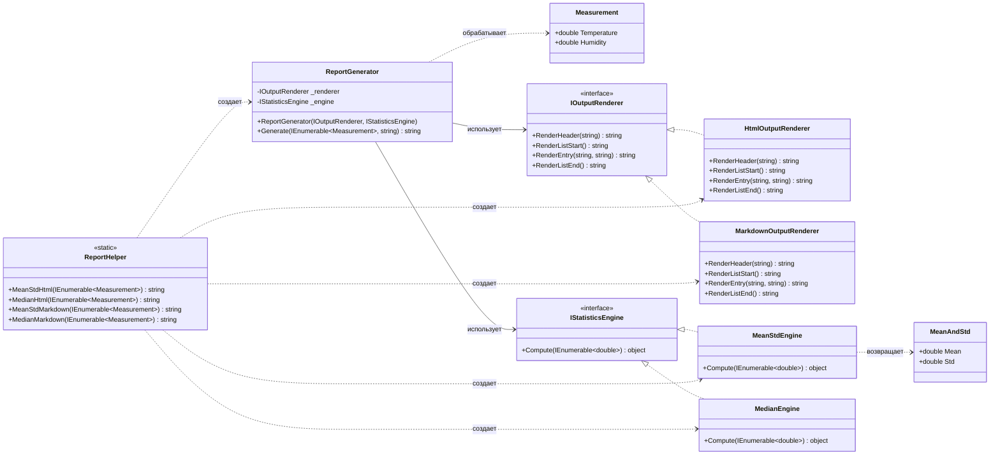

# Практика: Генератор отчетов

## 1. Описание предметной области и сущностей

Система подготовки статистических сводок по погодным измерениям. Производит вычисление показателей (среднее значение, стандартное отклонение, медиана) для двух метрик (температура и влажность) и формирует вывод в HTML и Markdown.

IStatisticsEngine - задает метод Compute для расчета показателей

MeanStdEngine - обсчитывает среднее и отклонение, реализует IStatisticsEngine

MedianEngine - находит медиану ряда, реализует IStatisticsEngine

IOutputRenderer - определяет методы RenderHeader, RenderListStart, RenderEntry, RenderListEnd для построения вывода

HtmlOutputRenderer - формирует HTML-разметку, реализует IOutputRenderer

MarkdownOutputRenderer - формирует Markdown-разметку, реализует IOutputRenderer

ReportGenerator - связывает рендерер и вычислитель, метод Generate создает отчет

ReportHelper - предоставляет четыре готовых метода: MeanStdHtml, MedianHtml, MeanStdMarkdown, MedianMarkdown

Measurement - содержит Temperature и Humidity

MeanAndStd - содержит Mean и Std
## 2. Диаграмма классов (Mermaid)

