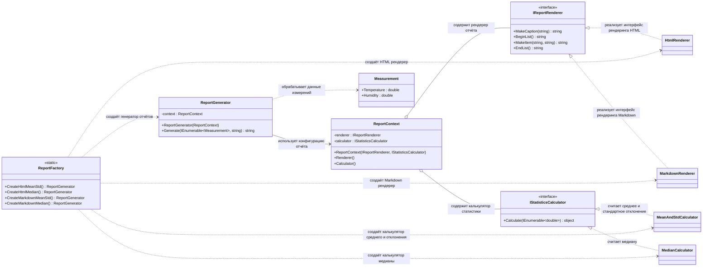

# Практика: Генератор отчетов

## 1. Описание предметной области и сущностей

Система подготовки статистических сводок по погодным измерениям.
Производит вычисление статистических показателей (среднее значение и стандартное отклонение, медиана) для двух метрик (температура и влажность) и формирует отчёты в HTML и Markdown форматах.

Measurement - содержит данные измерений температуры и влажности.

IStatisticsCalculator - интерфейс вычисления статистики, определяет метод Calculate, возвращающий результат расчёта.

MeanStdCalculator - вычисляет среднее значение и стандартное отклонение, реализует IStatisticsCalculator.

MedianCalculator - вычисляет медиану набора данных, реализует IStatisticsCalculator.

IReportRenderer - интерфейс формирования отчёта, определяет методы для создания заголовка, списка и элементов отчёта.

HtmlRenderer - формирует отчёт в формате HTML, реализует IReportRenderer.

MarkdownRenderer - формирует отчёт в формате Markdown, реализует IReportRenderer.

ReportContext - содержит выбранные стратегии: рендерер отчёта и вычислитель статистики, обеспечивает их совместное использование.

ReportGenerator - формирует итоговый отчёт, используя ReportContext, обрабатывает список измерений и вызывает рендерер и вычислитель.

ReportFactory - предоставляет методы создания готовых конфигураций ReportGenerator для HTML и Markdown отчётов с разными типами статистики.
## 2. Диаграмма классов (Mermaid)

