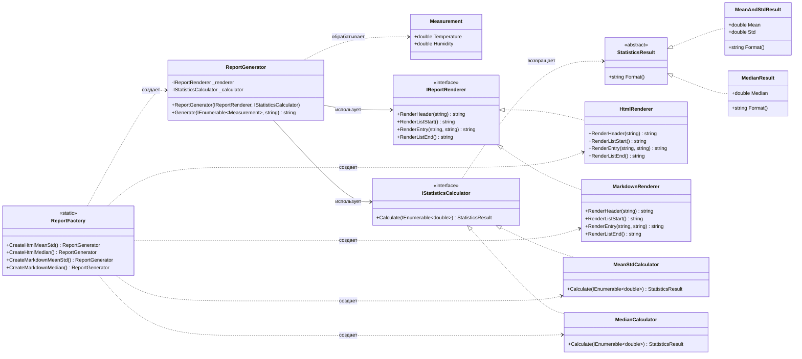

# Практика: Генератор отчетов

## 1. Описание предметной области и сущностей

Система подготовки статистических сводок по погодным измерениям. Производит вычисление показателей (среднее значение, стандартное отклонение, медиана) для двух метрик (температура и влажность) и формирует вывод в HTML и Markdown.

StatisticsResult - абстрактный класс, задает метод Format для форматирования результата вычислений.

MeanAndStdResult - содержит Mean и Std, реализует StatisticsResult, метод Format возвращает строку со средним и стандартным отклонением.

MedianResult - содержит Median, реализует StatisticsResult, метод Format возвращает строку с медианой.

IStatisticsCalculator - интерфейс, задает метод Calculate для расчета показателей, возвращает StatisticsResult.

MeanStdCalculator - обсчитывает среднее и стандартное отклонение, реализует IStatisticsCalculator, возвращает MeanAndStdResult.

MedianCalculator - находит медиану ряда, реализует IStatisticsCalculator, возвращает MedianResult.

IReportRenderer - определяет методы RenderHeader, RenderListStart, RenderEntry, RenderListEnd для построения вывода.

HtmlRenderer - формирует HTML-разметку, реализует IReportRenderer.

MarkdownRenderer - формирует Markdown-разметку, реализует IReportRenderer.

ReportGenerator - связывает рендерер и вычислитель, метод Generate создает отчет.

ReportFactory - предоставляет четыре статических метода: CreateHtmlMeanStd, CreateHtmlMedian, CreateMarkdownMeanStd, CreateMarkdownMedian для создания готовых генераторов отчетов.

Measurement - содержит Temperature и Humidity.
## 2. Диаграмма классов (Mermaid)

