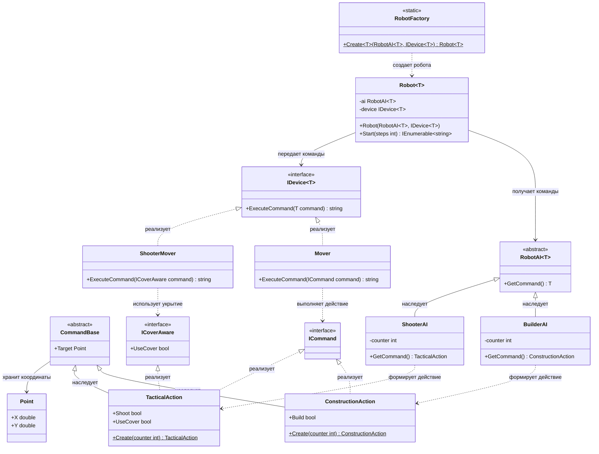

# Практика: Роботы

## 1. Описание предметной области и сущностей

Система управления роботами построена на разделении логики формирования команд и их выполнения. Искусственный интеллект отвечает за принятие решений, а исполнительные устройства - за выполнение действий.

RobotAI - абстрактный обобщённый базовый класс искусственного интеллекта. Определяет метод получения команды GetCommand().

ShooterAI - искусственный интеллект боевого робота. Формирует тактические действия, содержащие информацию о стрельбе и использовании укрытия.

BuilderAI- искусственный интеллект строительного робота. Формирует действия, связанные со строительством и перемещением.

IDevice - обобщённый интерфейс исполнительного устройства. Определяет метод ExecuteCommand() для выполнения команды.

Mover - устройство перемещения. Выполняет базовые команды движения.

ShooterMover - специализированное устройство перемещения. Выполняет команды, учитывающие использование укрытия.

ICommand - интерфейс исполнимой команды. Используется устройствами для выполнения действий.

ICoverAware - интерфейс команд, поддерживающих использование укрытия. Содержит признак UseCover.

CommandBase - абстрактный базовый класс команды. Содержит координаты цели Target.

ConstructionAction - действие строительного робота. Содержит признак строительства Build. Статический метод Create формирует действие на основе счётчика.

TacticalAction - действие боевого робота. Содержит признаки стрельбы Shoot и использования укрытия UseCover. Статический метод Create формирует действие на основе счётчика.

Point - структура координат. Хранит положение объекта через значения X и Y.

Robot - основной класс робота. Объединяет искусственный интеллект и исполнительное устройство, а также запускает цикл выполнения команд.

RobotFactory — статическая фабрика роботов. Создаёт экземпляры Robot с заданными компонентами искусственного интеллекта и исполнительного устройства.

## 2. Диаграмма классов (Mermaid)

