# Практика: Роботы

## 1. Описание предметной области и сущностей
Система управления роботами, построенная на разделении логики генерации команд и их выполнения. 
AI отвечает за принятие решений, Device - за исполнение.

RobotAI - абстрактный базовый класс для искусственного интеллекта. Определяет метод получения команды.

ShooterAI - AI стреляющего робота. Генерирует команды с информацией о стрельбе и укрытии.

BuilderAI - AI строительного робота. Генерирует простые команды перемещения.

IDevice - интерфейс исполнительного устройства. Описывает метод выполнения команды.

Mover - устройство передвижения. Обрабатывает команды движения.

ShooterMover - устройство передвижения со стрельбой. Обрабатывает команды с учетом укрытия.

IMoveCommand - интерфейс команды движения. Содержит координаты назначения.

IShooterMoveCommand - интерфейс команды стрелка. Добавляет флаг необходимости укрытия.

ShooterAction - команда для стреляющего робота. Содержит координаты, флаги стрельбы и укрытия.
Статический метод Create создает команду на основе счетчика.

BuilderAction - команда для строительного робота. Содержит координаты и флаг строительства.
Статический метод Create создает команду на основе счетчика.

Point - структура координат. Хранит позицию X и Y.

Robot - основной класс робота. Связывает AI и Device, запускает цикл выполнения команд.

RobotFactory - статический фабричный класс. Создает экземпляры роботов с заданными AI и Device.
## 2. Диаграмма классов (Mermaid)

```mermaid
classDiagram
    direction TB

    class RobotAI~T~ {
        <<abstract>>
        +GetCommand() T
    }

    class ShooterAI {
        -int counter
        +GetCommand() ShooterAction
    }

    class BuilderAI {
        -int counter
        +GetCommand() BuilderAction
    }

    class IDevice~T~ {
        <<interface>>
        +ExecuteCommand(T command) string
    }

    class Mover {
        +ExecuteCommand(IMoveCommand command) string
    }

    class ShooterMover {
        +ExecuteCommand(IShooterMoveCommand command) string
    }

    class IMoveCommand {
        <<interface>>
        +Destination Point
    }

    class IShooterMoveCommand {
        <<interface>>
        +Destination Point
        +ShouldHide bool
    }

    class ShooterAction {
        +Destination Point
        +Shoot bool
        +ShouldHide bool
        +Create(counter int) ShooterAction$
    }

    class BuilderAction {
        +Destination Point
        +Build bool
        +Create(counter int) BuilderAction$
    }

    class Point {
        +X double
        +Y double
    }

    class Robot~T~ {
        -ai RobotAI~T~
        -device IDevice~T~
        +Robot(RobotAI~T~ ai, IDevice~T~ device)
        +Start(steps int) IEnumerable~string~
    }

    class RobotFactory {
        <<static>>
        +Create~T~(RobotAI~T~ ai, IDevice~T~ device) Robot~T~$
    }

    RobotAI~T~ <|-- ShooterAI : наследует
    RobotAI~T~ <|-- BuilderAI : наследует
    IDevice~T~ <|.. Mover : реализует
    IDevice~T~ <|.. ShooterMover : реализует
    
    IMoveCommand <|-- IShooterMoveCommand : расширяет
    
    ShooterAction ..|> IShooterMoveCommand : реализует
    BuilderAction ..|> IMoveCommand : реализует
    
    ShooterAction --> Point : содержит
    BuilderAction --> Point : содержит
    Robot~T~ --> RobotAI~T~ : использует
    Robot~T~ --> IDevice~T~ : использует
    RobotFactory ..> Robot~T~ : создает
    ShooterAI ..> ShooterAction : создает
    BuilderAI ..> BuilderAction : создает
```

