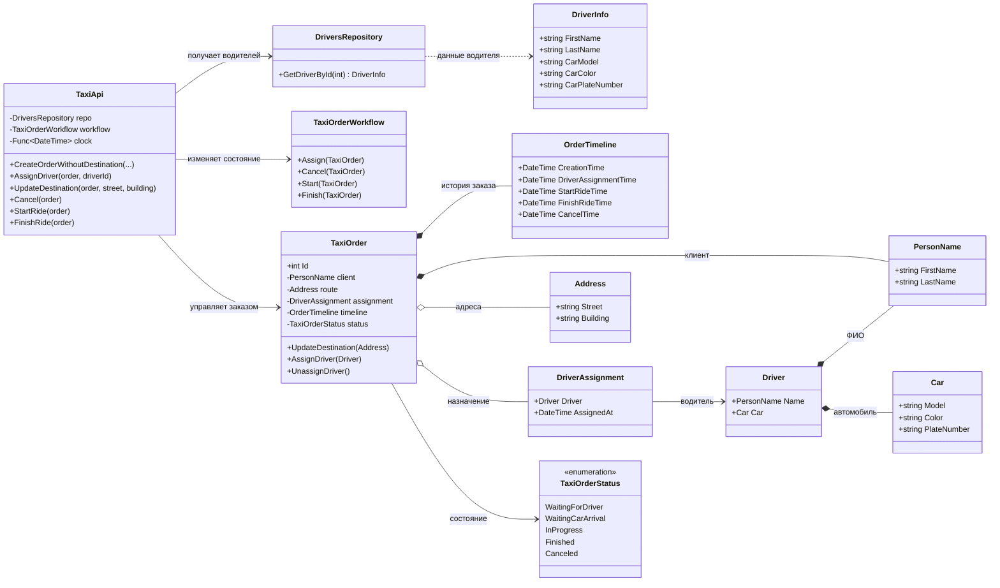

# Практика: TaxiOrder

## 1. Описание предметной области и сущностей

TaxiService - основной сервис управления поездками. Создаёт заказы, назначает водителей, изменяет маршрут и переводит поездку между состояниями.

Ride - сущность поездки. Хранит информацию о пассажире, маршруте, назначении водителя, текущем состоянии и истории выполнения.

Passenger - пассажир, оформивший поездку.

Driver - водитель такси. Содержит персональные данные и сведения об автомобиле.

DriverAssignment - информация о назначении водителя на поездку. Хранит ссылку на водителя и время назначения.

Route - маршрут поездки, содержащий точку отправления и точку назначения.

RideTimeline - история жизненного цикла поездки. Содержит даты основных событий заказа.

DriverCatalog - источник данных о водителях. Используется для поиска водителя по идентификатору.

TripWorkflow - компонент управления состояниями поездки. Выполняет переходы между этапами выполнения заказа.

Vehicle - автомобиль водителя.

PersonName - имя и фамилия человека.

Location - адрес маршрута.

TripStage - перечисление состояний поездки.

## 2. Диаграмма классов (Mermaid)

