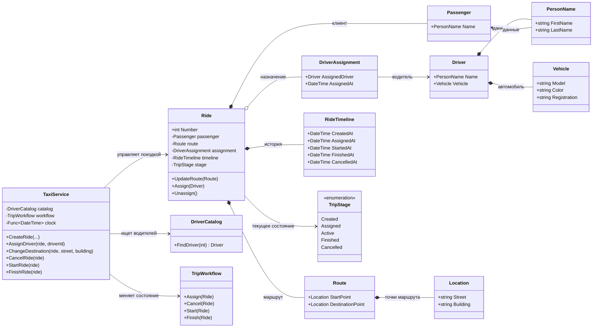

# Практика: TaxiOrder

## 1. Описание предметной области и сущностей

TaxiService - сервис управления поездками такси. Создаёт новые поездки, назначает и снимает водителей, изменяет маршрут и переводит поездку между этапами выполнения.

Ride - Основная сущность поездки. Хранит информацию о пассажире, маршруте, назначенном водителе, текущем состоянии и истории выполнения заказа.

Passenger - пассажир, который оформил поездку. Содержит персональные данные клиента.

Driver - водитель такси. Хранит сведения о человеке и используемом автомобиле.

DriverAssignment - объект назначения водителя на поездку. Содержит ссылку на водителя и время назначения.

Route - маршрут поездки. Описывает начальную и конечную точки следования.

RideTimeline - история жизненного цикла поездки. Содержит даты создания, назначения водителя, начала, завершения или отмены поездки.

DriverCatalog - источник данных о водителях. Используется для поиска и получения информации о доступных водителях.

TripWorkflow - компонент бизнес-логики переходов между состояниями поездки. Отвечает за правила назначения, отмены, начала и завершения поездки.

Vehicle - автомобиль водителя.

PersonName - фамилия и имя человека.

Location - адресная точка маршрута.

TripStage - перечисление этапов жизненного цикла поездки

## 2. Диаграмма классов (Mermaid)

